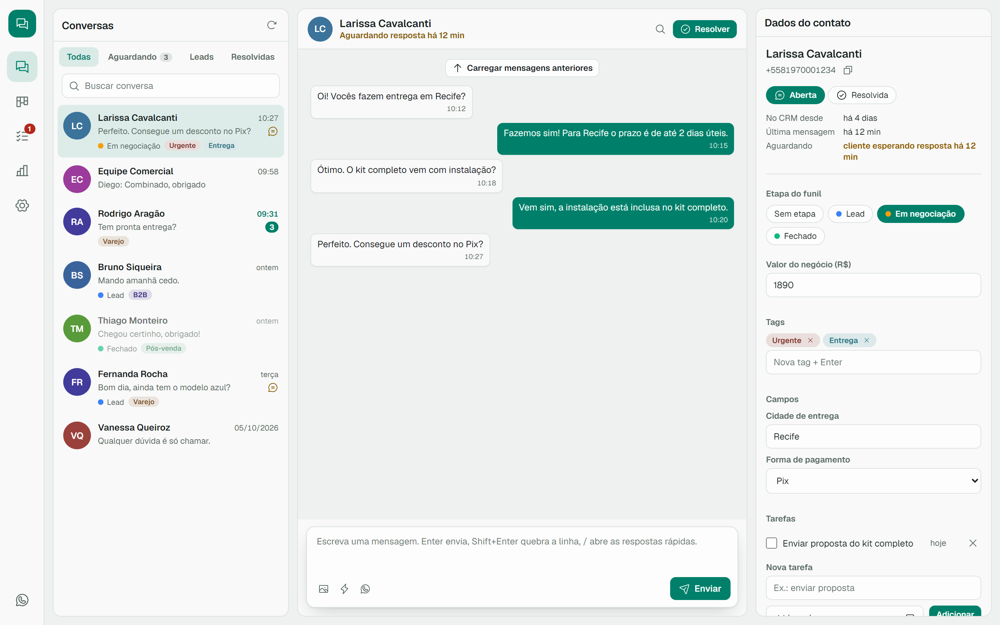
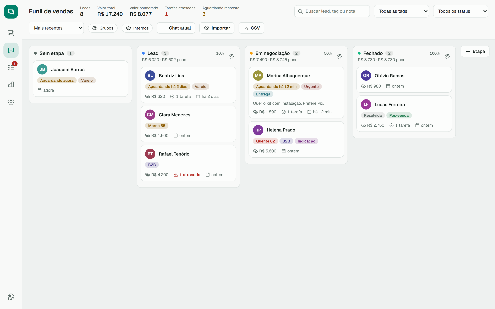
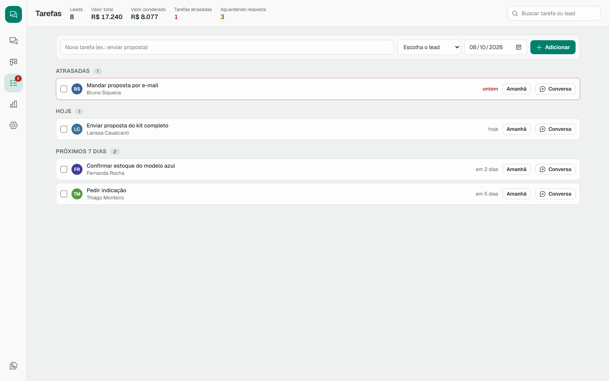
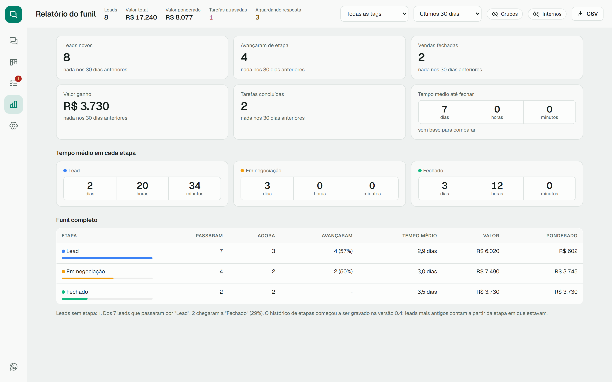
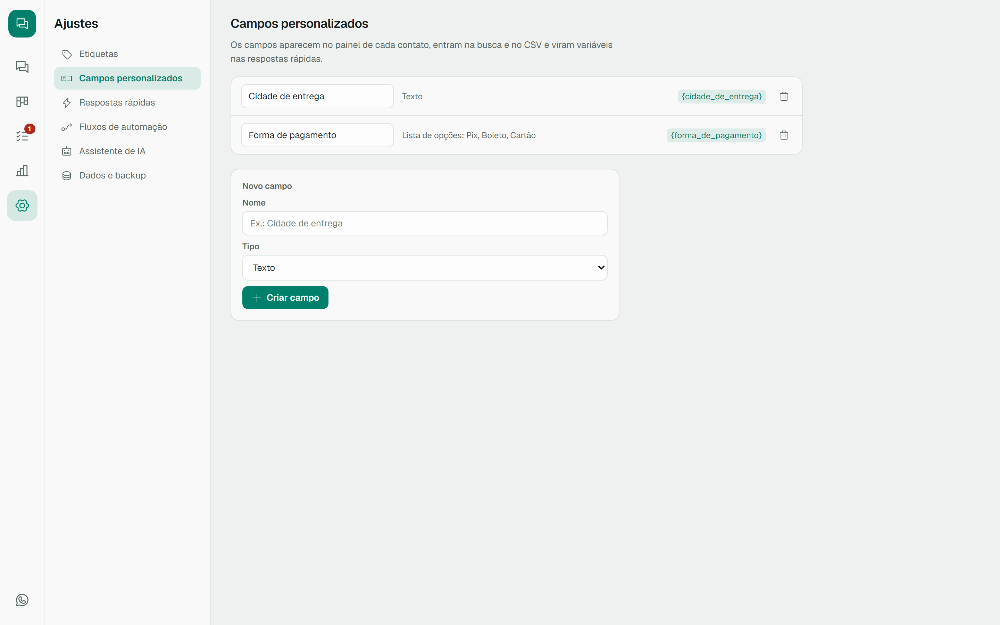
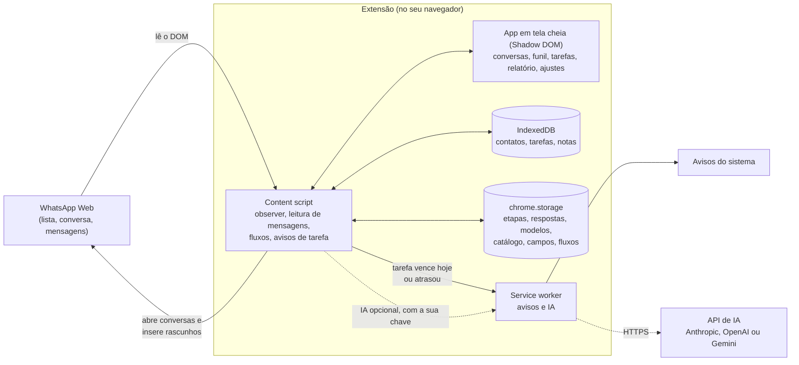

<div align="center">

# WA Local CRM

**Um CRM completo por cima do WhatsApp Web. Gratuito, open source e 100% local.**

Caixa de entrada com status, funil de vendas, tarefas, relatório, respostas rápidas, automações e um assistente
de IA opcional, tudo rodando no seu navegador. Seus dados não saem do seu computador.

[](LICENSE)
[](https://developer.chrome.com/docs/extensions/develop/migrate/what-is-mv3)
[](https://www.typescriptlang.org/)
[](#como-contribuir)

</div>



---

## O que ele faz

Assim que o WhatsApp Web carrega, o CRM abre em tela cheia por cima dele. O WhatsApp continua funcionando por baixo:
é dele que vêm as conversas e é por ele que as mensagens saem. Um clique na barra lateral mostra o WhatsApp original.

| Recurso | O que faz |
|---|---|
| **Caixa de entrada** | Conversas, chat e dados do contato lado a lado. Filtros por aguardando resposta, leads e resolvidas. |
| **Status da conversa** | Aberta ou resolvida. A extensão marca quem está esperando resposta e reabre a conversa se o cliente escrever de novo. |
| **Funil de vendas** | Arraste leads entre etapas, filtre por tag e status, ordene pelos mais quentes e exporte ou importe CSV. |
| **Tarefas** | Todas as tarefas de todos os leads, agrupadas em atrasadas, hoje e próximos dias. |
| **Relatório** | Leads novos, vendas fechadas, valor ganho, tarefas concluídas e tempo até fechar, comparados com o período anterior. Tempo médio em cada etapa e conversão do funil. |
| **Campos personalizados** | Crie campos como cidade ou forma de pagamento. Eles entram no painel, na busca, no CSV e nas respostas rápidas. |
| **Etiquetas** | Cores, renomear e apagar em um lugar só, valendo para todos os contatos e fluxos. |
| **Respostas rápidas** | Digite `/` no campo de mensagem. Aceita `{nome}`, `{primeiro_nome}`, `{saudacao}`, `{data}` e os seus campos. |
| **Fotos** | Envie fotos pelo CRM: botão, Ctrl+V ou arrastar, com legenda. |
| **Modelos de mensagem** | Mensagens prontas por categoria, com os mesmos campos das respostas rápidas. |
| **Catálogo** | Produtos e serviços com preço. Adicione ao lead e o valor do negócio é calculado sozinho. |
| **Avisos de tarefa** | Aviso no computador quando uma tarefa vence hoje ou atrasa. Clicar abre a conversa. |
| **Transcrição** | Copie ou baixe a conversa em .txt, com autor e horário. |
| **Automações locais** | "Lead parado 3 dias → criar follow-up", "cliente pediu preço → mover etapa". Nenhuma automação envia mensagem. |
| **Assistente de IA (opcional)** | Com a sua chave da Anthropic, OpenAI ou Google Gemini: temperatura do lead, resumo, próximo passo e rascunho de resposta. Você revisa e envia. |
| **Tema claro e escuro** | Botão na barra lateral. Também dá para seguir o tema do WhatsApp. |
| **Grupos e internos** | Grupos ficam fora do funil por padrão; contatos da equipe podem ser marcados como internos. |
| **Importar e exportar** | Importe leads por CSV com prévia antes de gravar. Backup completo em JSON. |

<table>
  <tr>
    <td width="50%"></td>
    <td width="50%"></td>
  </tr>
  <tr>
    <td align="center">Funil de vendas</td>
    <td align="center">Tarefas</td>
  </tr>
  <tr>
    <td width="50%"></td>
    <td width="50%"></td>
  </tr>
  <tr>
    <td align="center">Relatório</td>
    <td align="center">Ajustes</td>
  </tr>
</table>

<sub>Prints com dados fictícios.</sub>

## Privacidade

Tudo fica **no seu navegador** (`chrome.storage.local` e IndexedDB). Não existe servidor, conta ou telemetria.

A única exceção é o assistente de IA, que vem **desligado**. Se você ligar e usar, o nome do contato e até 30 mensagens
da conversa analisada vão direto para a API que você escolheu, com a sua chave. A chave fica só no seu navegador e
não entra no backup.

---

## Como funciona

A extensão lê a página do WhatsApp Web, guarda o CRM no próprio navegador e desenha o app em tela cheia por cima,
isolado num Shadow DOM. O service worker mostra os avisos de tarefa do sistema e, só quando o assistente de IA está
ligado, faz as chamadas externas, direto para o provedor que você escolheu.



## Como baixar e instalar

A extensão ainda não está na Chrome Web Store, então a instalação é pelo modo do desenvolvedor. Leva uns 5 minutos.

### 1. O que você precisa

- **Google Chrome** ou **Microsoft Edge**
- **Node.js 18 ou mais novo**: baixe em [nodejs.org](https://nodejs.org/) (a versão LTS serve)
- **Git** (opcional): baixe em [git-scm.com](https://git-scm.com/)

### 2. Baixe o código

**Com Git:**

```bash
git clone https://github.com/vileondev/minicrm.git
cd minicrm
```

**Sem Git:** no topo desta página, clique em **Code → Download ZIP**, extraia o arquivo e abra um terminal dentro da pasta extraída.

### 3. Gere a extensão

```bash
npm install
npm run build
```

Isso cria a pasta **`dist`**, que é a extensão pronta.

### 4. Carregue no navegador

1. Abra `chrome://extensions` (Chrome) ou `edge://extensions` (Edge).
2. Ligue o **Modo do desenvolvedor**: canto superior direito no Chrome, menu lateral no Edge.
3. Clique em **Carregar sem pacote** e escolha a pasta **`dist`**.
4. Abra (ou recarregue) [web.whatsapp.com](https://web.whatsapp.com).

Pronto: depois de entrar no WhatsApp, o CRM abre em tela cheia.

### Atualizar para uma versão nova

```bash
git pull
npm install
npm run build
```

Depois clique em recarregar no card da extensão em `chrome://extensions` e dê F5 no WhatsApp. Seus dados continuam lá.
Se você baixou o ZIP, baixe de novo e repita os passos 3 e 4.

---

## Primeiros passos

1. Abra o WhatsApp Web. O CRM aparece sozinho quando ele termina de carregar (dá para desligar em **Ajustes → Dados e backup**).
2. Em **Conversas**, escolha uma conversa e clique em **Adicionar ao funil**. Na coluna da direita, defina etapa, valor, tags, campos e tarefas.
3. Responda pelo campo de mensagem e marque **Resolver** quando terminar. Se o cliente escrever de novo, a conversa reabre.
4. Em **Ajustes**, crie respostas rápidas, modelos de mensagem, campos personalizados, etiquetas, o catálogo de produtos e os fluxos.
5. Já tem uma lista de clientes? Em **Ajustes → Dados e backup → Importar leads (CSV)**. A prévia mostra o que vai entrar antes de gravar.
6. Quer IA? Em **Ajustes → Assistente de IA**, ligue o assistente, escolha o provedor e cole a sua chave.

Fotos você envia pelo próprio CRM (botão de imagem, Ctrl+V ou arrastar para a conversa).

Áudios, documentos e chamadas continuam no WhatsApp original: use o ícone do WhatsApp na barra lateral e volte pelo
botão verde que aparece no canto.

| Atalho | Ação |
|---|---|
| `Alt+K` | Alternar entre o CRM e o WhatsApp original |
| `Alt+P` | Painel do contato sobre o WhatsApp original |
| `/` no campo de mensagem | Respostas rápidas |
| `Enter` / `Shift+Enter` | Enviar / quebrar a linha |

Para trocar o tema, use o botão de sol ou lua na barra lateral. Em **Ajustes → Dados e backup** você também pode escolher seguir o tema do WhatsApp.

### Onde conseguir uma chave de IA

| Provedor | Onde criar a chave | Modelo padrão |
|---|---|---|
| Anthropic (Claude) | [console.anthropic.com](https://console.anthropic.com/) | `claude-haiku-4-5-20251001` |
| OpenAI | [platform.openai.com](https://platform.openai.com/api-keys) | `gpt-4o-mini` |
| Google (Gemini) | [aistudio.google.com](https://aistudio.google.com/apikey) | `gemini-2.5-flash` |

O uso é cobrado pelo provedor, na sua conta.

---

## Problemas comuns

**O CRM não aparece no WhatsApp:** confira se a extensão está ativada em `chrome://extensions` e dê F5 no WhatsApp.

**Não abre a conversa de um lead:** use **Tentar de novo** ou **Abrir no WhatsApp** e abra a conversa por lá. Na coluna
de dados do contato, **Ler do perfil** vincula o número do telefone, o que deixa a busca bem mais confiável.

**Quero usar o WhatsApp normal:** clique no ícone do WhatsApp na barra lateral ou aperte **Alt+K**. Para não abrir o CRM
sozinho, desligue a opção em **Ajustes → Dados e backup**.

**Os avisos de tarefa não aparecem:** eles precisam do WhatsApp Web aberto em alguma aba (pode ser em segundo plano) e
das notificações do navegador liberadas no sistema. Confira também **Ajustes → Dados e backup → Abertura e avisos**.

**A foto não foi enviada:** o CRM usa o editor de fotos do próprio WhatsApp. Se ele não abrir, o WhatsApp original aparece
para você concluir o envio por lá, e a foto continua anexada no CRM. Se a legenda não entrar no editor, o texto vai logo
depois da foto, como mensagem, e o CRM avisa.

**Parou de funcionar depois de uma atualização do WhatsApp:** o WhatsApp muda o site com frequência. No painel, vá em
**Ajustes → Dados e backup → Copiar diagnóstico** (os números saem mascarados) e abra uma [issue](https://github.com/vileondev/minicrm/issues) com ele.

---

## Como contribuir

Contribuições são muito bem-vindas: correções, novos recursos, traduções, melhorias de texto.

1. Faça um fork e crie um branch: `git checkout -b minha-melhoria`
2. Rode `npm run build` e teste no WhatsApp Web (recarregue a extensão a cada build)
3. Confira os tipos com `npm run typecheck`
4. Abra um pull request explicando o que mudou e por quê

### Estrutura do código

| Caminho | O que tem |
|---|---|
| `src/utils/domSelectors.ts` | Todos os seletores do WhatsApp. **Comece por aqui quando o WhatsApp mudar.** |
| `src/content/` | Entrada, observer, leitura de mensagens, lista de conversas, métricas, importação de CSV, avisos, automações e IA |
| `src/components/` | App em tela cheia (Shadow DOM): caixa de entrada, funil, tarefas, relatório, ajustes e painel do contato |
| `src/storage/` | IndexedDB (contatos) e `chrome.storage.local` (etapas, respostas, modelos, catálogo, fluxos, configurações) |
| `src/background.ts` | Service worker: mostra os avisos de tarefa e é a única parte que fala com as APIs de IA |

---

## Aviso

Este projeto não tem relação com o WhatsApp nem com a Meta. Ele depende da estrutura do WhatsApp Web, que muda sem aviso.
Use com bom senso: automações de envio em massa podem violar os termos de uso do WhatsApp. Por isso, nenhuma automação
desta extensão envia mensagens sozinha.

## Licença

Copyright © 2026 Victor Leon

Este programa é software livre: você pode redistribuí-lo e modificá-lo sob os termos da
[GNU General Public License](LICENSE), publicada pela Free Software Foundation, na versão 3 ou (a seu critério) qualquer versão posterior.
Ele é distribuído na esperança de ser útil, mas **sem nenhuma garantia**. Veja o arquivo [LICENSE](LICENSE) para os detalhes.

A fonte [Geist](https://github.com/vercel/geist-font) é distribuída sob a SIL Open Font License (veja `public/fonts/Geist-OFL-LICENSE.txt`)
e os ícones são do [Phosphor Icons](https://phosphoricons.com/) (MIT).
